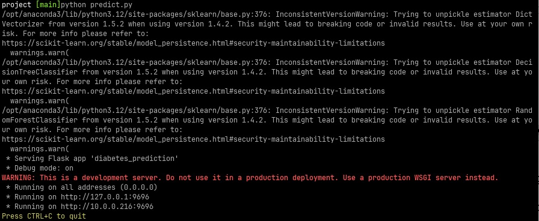
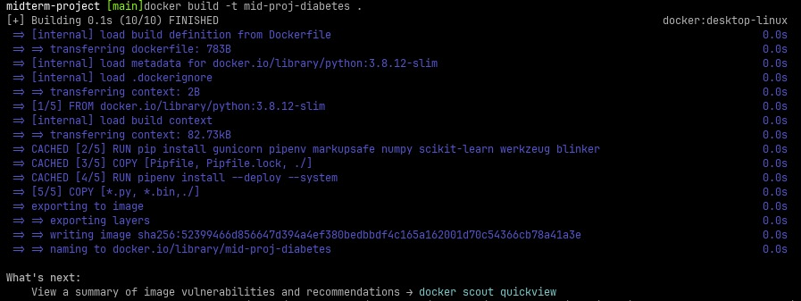
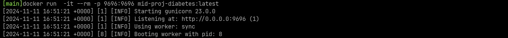
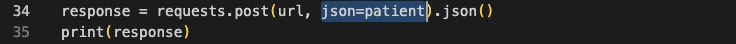
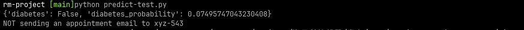

### 1. Problem Identification

- **Problem**: Predict the likelihood of a patient developing diabetes based on health metrics.
- **Goal**: Build a classification model to predict diabetes (binary outcome: 1 for diabetic, 0 for non-diabetic).
- **Dataset**: The dataset includes features such as `Pregnancies`, `Glucose`, `BloodPressure`, `SkinThickness`, `Insulin`, `BMI`, `DiabetesPedigreeFunction`, `Age`, and the target variable `Outcome`.

### 2. Exploratory Data Analysis (EDA)

- **Initial Analysis**:
  - Display summary statistics and basic dataset information.
  - Check for missing values.
- **Visualizations**:
  - Plot distributions for numerical columns (e.g., `Glucose`, `Age`).
  - Display a correlation heatmap to analyze relationships between features.
  - Create box plots to identify outliers in continuous variables.
- **Outcome Analysis**:
  - Visualize the balance of the target variable `Outcome`.

### 3. Data Preparation

- **Handle Missing Values**:
  - Replace zero values in relevant columns with `NaN` and impute them using median values.
- **Feature Scaling**:
  - Normalize or standardize numerical features.

### 4. Feature Engineering

- **Additional Features**:
  - Create `BMI_Category` based on BMI ranges.
- **Feature Importance**:
  - Use correlation and feature selection techniques to identify important features.

### 5. Model Training

- **Python environment**:
  ```console
  pip install -r requirements.txt
  ```
- **Models**:
  - Train models such as Logistic Regression, Decision Trees, and Random Forests.
  - See `mid_project_notebook.ipynb`
- **Evaluation Metrics**:
  - Use accuracy, precision, recall, F1-score, and AUC-ROC for evaluation.
  - AUC
    - Logistic Regression {C=1}: `0.8687162442874948`
    - Decision Trees {max_depth=5, min_samples_leaf=15}: `0.7993352721229747`
    - Random Forests {max_depth=5, n_estimators=20, random_state=1}: `0.8807644370585791` \*\*
- **Model Training Python Script**:
  ```console
  python train.py
  ```
  - Will save the model to `rfc_model_n_estimators=21_max_depth=5_min_samples_leaf=1.bin`

### 6. Export Notebook to Script

- **Python script**:
  - Local Service: Python script (`predict.py`).
  ```console
  python predict.py
  ```
  - Client Code: Python script (`prediction-test.py`).
  ```console
  python prediction-test.py
  ```

### 7. Model Deployment with Docker

- **Create a Web Service**:
  - Develop a Flask or FastAPI app (`predict.py`) to handle prediction requests.
- **Dockerize**:
  - Write a `Dockerfile` to set up the environment and run the service.
- **Run Locally**:
  - Build and run the Docker container to test the service locally.
  - Build docker file
  ```console
  docker build -t mid-pro-diabetes .
  ```
  - Run docker service
  ```console
  docker run  -it --rm -p 9696:9696 mid-proj-diabetes:latest
  ```

### 8. Testing Scenario 1: Local Service

- Open a terminal and run prediction local service: (`predict.py`).

```console
python predict.py
```



- Open another terminal and run local client: (`prediction-test.py`).

```console
python prediction-test.py
```


- In first terminal, press CTRL+C to stop local service

### 9. Testing Scenario 2: Docker Service

- Open a terminal and build docker service: (`Dockerfile`).

```console
docker build -t mid-proj-diabetes .
```



- Run docker service in the same terminal

```console
docker run  -it --rm -p 9696:9696 mid-proj-diabetes:latest
```



- Modify code (Change `json=patient2` to `json=patient`in line 34)



- Open another terminal. Run local client: (`prediction-test.py`).

```console
python prediction-test.py
```


